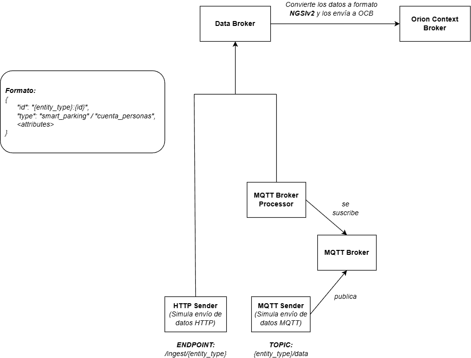
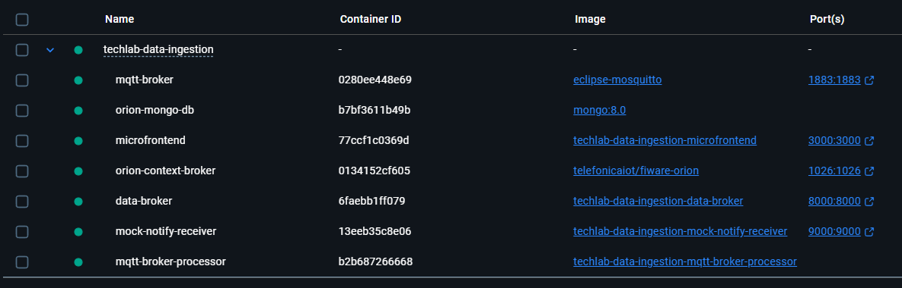
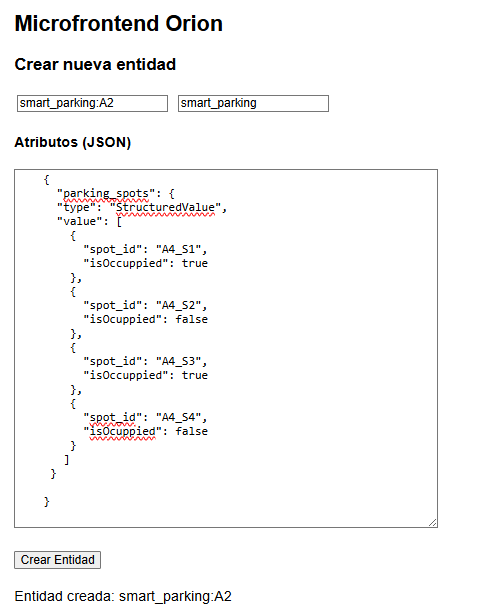
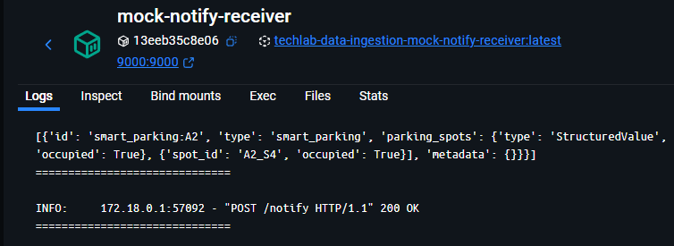
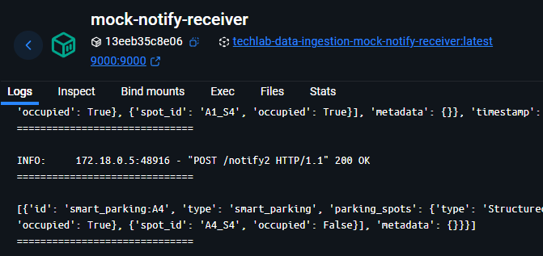
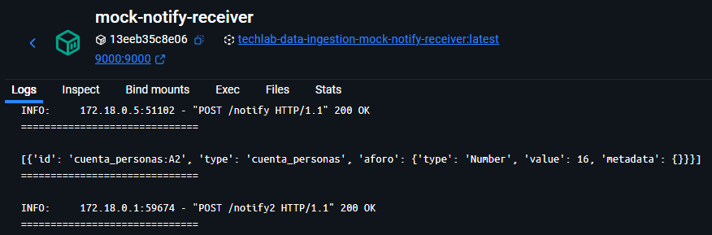
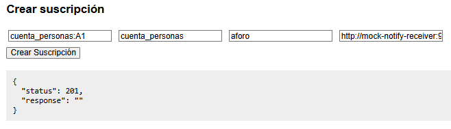
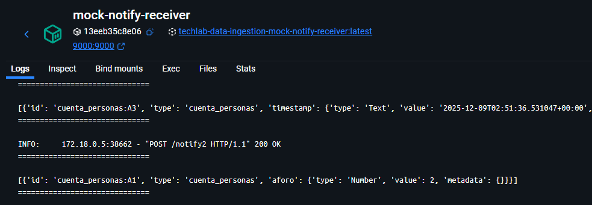
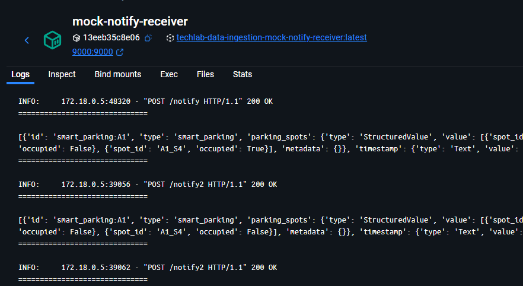

# TechLab - Módulo de ingestión de datos V.2

Sistema de ingesta de datos IoT basado en microservicios con FIWARE Orion Context Broker y MQTT.

## Arquitectura

El proyecto está compuesto por los siguientes servicios:

### Backend Services

#### 1. **Data Broker** (`data-broker`)
- **Puerto**: 8000
- **Función**: API REST para ingesta de datos HTTP
- **Endpoint principal**: `POST /ingest/{entity_type}`
- Recibe datos JSON y los transforma a formato NGSI-v2
- Crea o actualiza entidades en Orion Context Broker
- Soporta modelos configurables vía `schemas/models.json`

#### 2. **MQTT Broker Processor** (`mqtt-broker-processor`)
- **Función**: Procesador de mensajes MQTT
- Suscrito a topics configurados (smart_parking, cuenta_personas, lorawan)
- Decodifica payloads Base64 y los envía a Orion
- Mapeo automático de topics a modelos de entidad

#### 3. **Mock Notify Receiver** (`mock-notify-receiver`)
- **Puerto**: 9000
- **Endpoints**: `/notify`, `/notify2`
- Receptor de prueba para notificaciones de Orion
- Imprime los datos recibidos en consola

#### 4. **MQTT Broker** (`mqtt-broker`)
- **Puerto**: 1883
- Broker Eclipse Mosquitto para comunicación MQTT
- Configuración en `mqtt_config/mosquitto.conf`



### Frontend

#### **Microfrontend** (`microfrontend`)
- **Puerto**: 3000
- Interfaz web para gestionar entidades NGSI
- Permite crear, consultar, actualizar y eliminar entidades
- Interactúa directamente con Orion Context Broker

### FIWARE Components

#### **Orion Context Broker** (`orion`)
- **Puerto**: 1026
- Gestión de contexto basado en NGSI-v2
- Almacena y gestiona entidades IoT

#### **MongoDB** (`mongo`)
- Base de datos para persistencia de Orion

## Cómo levantar los servicios

### Prerequisitos
- Docker
- Docker Compose
- Crear un archivo de variables de entorno ```.env``` tanto en ```/backend``` como en ```/microfrontend```, solo debes copiar el contenido de ```.env.example``` sin ningún cambio a menos que desees otra configuración de puertos dentro del contenedor

### Iniciar todos los servicios
```bash
# Forma estándar desacoplada (sin imprimir los logs en la consola)
docker-compose up -d

# Si deseas reconstruir todo el proyecto y servicios desde cero
docker compose up --build --force-recreate --no-deps
```
Deberias ver algo como esto si usas Docker Desktop



### Verificar estado
```bash
docker-compose ps
```

### Ver logs
```bash
# Todos los servicios
docker-compose logs -f

# Servicio específico
docker-compose logs -f data-broker
```

### Detener servicios
```bash
docker-compose down
```

## Cómo crear una entidad

### Opción 1: Acceder al servicio de interfaz propio
 Para eso basta con acceder a ```http://localhost:3000``` y rellenar el formulario






### Opción 2: Crear la entidad mediante comandos ```curl```

```bash
# Ejemplo para el proyecto smart_parking
curl -iX POST 'http://localhost:1026/v2/entities' \
  -H 'Content-Type: application/json' \
  -d '{
    "id": "smart_parking:A4",
    "type": "smart_parking",
    "timestamp": {
      "type": "DateTime",
      "value": "2025-05-13T15:00:00Z"
    },
    "parking_spots": {
      "type": "StructuredValue",
      "value": [
        {
          "spot_id": "A4_S1",
          "isOccuppied": true
        },
        {
          "spot_id": "A4_S2",
          "isOcuppied": false
        },
        {
          "spot_id": "A4_S3",
          "isOccuppied": true
        },
        {
          "spot_id": "A4_S4",
          "isOcuppied": false
        }
      ]
    }
  }'
```



```bash
# Ejemplo para el proyecto cuenta_personas
curl -iX POST 'http://localhost:1026/v2/entities' \
  -H 'Content-Type: application/json' \
  -d '{
    "id": "cuenta_personas:A2",
    "type": "cuenta_personas",
    "camCode": {
      "type": "Text",
      "value": "A2"
    },
    "timestamp": {
      "type": "DateTime",
      "value": "2025-05-13T15:00:00Z"
    },
    "aforo": {
      "type": "Number",
      "value": 25
    }
  }'

```




## Cómo suscribir una entidad a un endpoint

### Opción 1: Acceder al servicio de interfaz propio
 Para eso basta con acceder a ```http://localhost:3000``` y rellenar el formulario



> **Nota 1:** Si el script de prueba se va a ejecutar en tu máquina local (no dentro del contenedor), la URL de suscripción (endpoint) deber escribirse de la siguiente manera ```http://host.docker.internal:<PORT>``` ya que al usar ```localhost```, docker entenderá que te refieres al mismo contenedor y no recibirás las notificaciones.

> **Nota 2:** Uno de los servicios levantados en docker es un receptor de notificaciones que imprime la información recibida en consola llamado **mock-notify-receiver** con 2 endpoints disponibles ```/notify``` y ```/notify2```, si deseas suscribir alguna entidad a este servicio, usa la URL ```http://mock-notify-receiver:9000/notify``` o ```http://mock-notify-receiver:9000/notify2```. Asegurate que el puerto configurado en la aplicación dentro del contenedor sea la misma que la de la URL.


### Opción 2: Crear la suscripción mediante comandos ```curl```

```bash
# Ejemplo para el proyecto cuenta_personas
curl -iX POST "http://localhost:1026/v2/subscriptions" \
  -H "Content-Type: application/json" \
  -d '{
    "description": "Suscripcion para cuenta_personas:A3",
    "subject": {
      "entities": [
        {
          "id": "cuenta_personas:A3",
          "type": "cuenta_personas"
        }
      ],
      "condition": {
        "attrs": ["aforo"]
      }
    },
    "notification": {
      "http": {
        "url": "http://mock-notify-receiver:9000/notify2"
      },
      "attrs": ["timestamp", "aforo"]
    },
    "throttling": 1
  }'

```




```bash
# Ejemplo para el proyecto smart_parking
curl -iX POST 'http://localhost:1026/v2/subscriptions' \
  -H 'Content-Type: application/json' \
  -d '{
    "description": "Suscripción para smart_parking:A1",
    "subject": {
      "entities": [
        {
          "id": "smart_parking:A1",
          "type": "smart_parking"
        }
      ],
      "condition": {
        "attrs": []
      }
    },
    "notification": {
      "http": {
        "url": "http://mock-notify-receiver:9000/notify2"
      },
      "attrs": []
    },
    "throttling": 1
  }'
```



## Modelos de datos

Los modelos se configuran en `backend/schemas/models.json`:
- `smart_parking`: Estacionamientos inteligentes
- `cuenta_personas`: Contadores de personas
- `lora_wan`: Dispositivos LoRaWAN

Cada modelo define su `id_field` para identificar entidades únicas.

## Utilidades

- **utils.py**: Función `json_to_ngsi_entity()` para convertir JSON a formato NGSI-v2
- Detección automática de tipos de datos (Boolean, Number, Text, StructuredValue)

## Testing

Scripts de prueba en `backend/tests/`:
- `send_http_data.py`: Envía datos vía HTTP al Data Broker
- `send_mqtt_data.py`: Publica datos en topics MQTT

Para hacer los tests basta con ejecutar los scripts de prueba localmente ya que los puertos locales han sido enlazados con los del contenedor

```bash
cd backend/tests/

python3 send_http_data.py

python3 send_mqtt_data.py
```