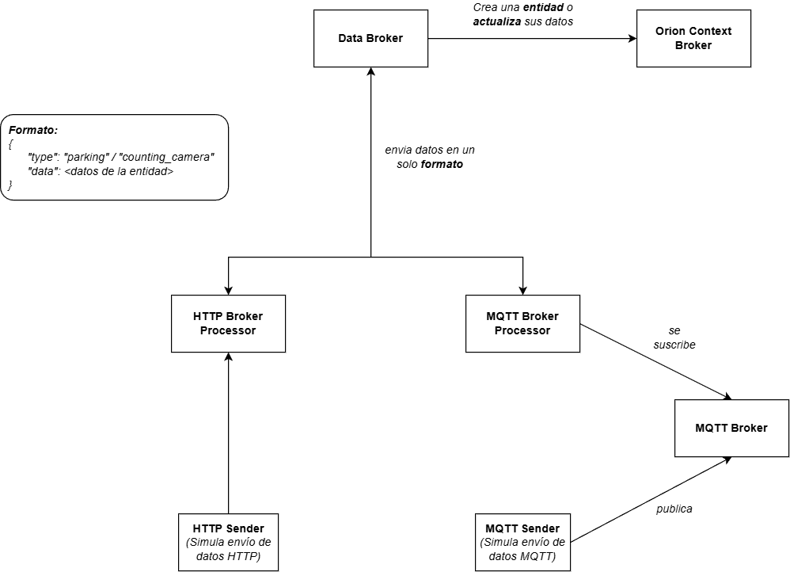
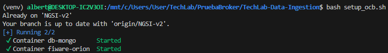
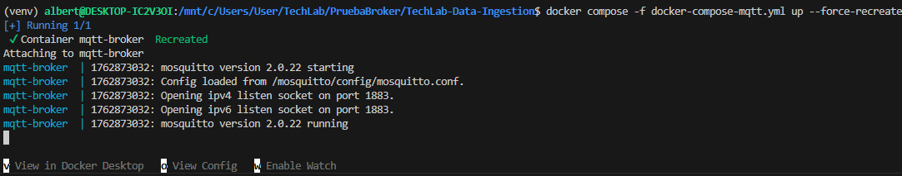
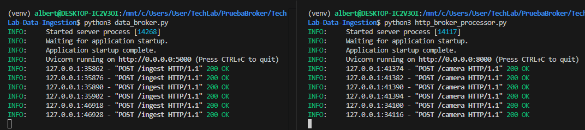
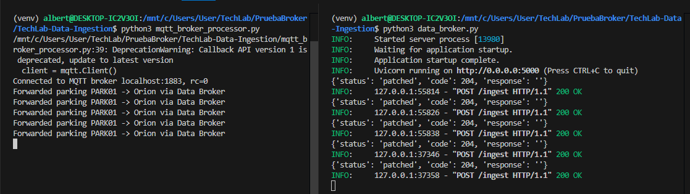

# TechLab - Prototipo de módulo de ingestión de datos V.1

## Arquitectura del módulo

El módulo de ingestión de datos se encarga de recibir los datos de los distintos proyectos de TechLab a través de distintos protocolos. Su función principal es gestionar los mensajes de entrada y estandarizarlos para su procesamiento en los siguientes módulos. A continuación se puede visualizar la arquitectura implementada para el primer prototipo de este módulo. Cabe mencionar que para esta versión esta pensada para experimentar con el envío de mensajes y de momento solo se ha implementado el procesamiento de mensajes para los proyectos **cuenta personas** y **smart parking**. En la siguiente versión se planea escalar la arquitectura y refactorizar los submódulos en su totalidad.



Componentes que lo conforman:

- **HTTP Broker Processor**: Componente encargado de recibir los datos mediante protocolo HTTP. Para ello se levanta un servidor en la *red local* con el puerto *8000*. Los datos se reciven a través del endpoint ```camera``` y se reenvían al ```Data Broker```.
- **MQTT Broker**: Servidor MQTT desplegado en *docker* a través del puerto *1883*. Actúa como intermediario entre los mensajes y el ```MQTT Broker Processor```
- **MQTT Broker Processor**: Componente encargado de recibir los datos mediante a ravés del ```MQTT Broker```. Para ello se crea un cliente MQTT que se suscribe a un **TOPIC** del ```MQTT Broker``` y reenvía los datos al ```Data Broker```.
- **HTTP Sender**: Componente que simula un dispositivo IoT que envía datos a través del protocolo HTTP. Esto se logra enviando requests de tipo **POST** al ```HTTP Boker Processor```, en este caso se simulan los datos del **Cuenta personas**.
- **MQTT Sender**: Componente que simula un dispositivo IoT que envía actualizaciones de sus atributos, en este caso los estacionamientos del **Smart Parking**. Esto se logra conectandose mediante protocolo **MQTT** al ```MQTT Broker``` y publicando los datos al **Topic correspondiente**.

- **Data Broker**: Componente encargado de recibir los datos reenviados por el ```HTTP Broker Processor``` y el ```MQTT Broker Processor``` para su procesamiento. Si la entidad que envía los datos no esta registrada en *Orion Context Broker*, se crea, de otro modo, los datos simplemente se actualizan.
- **Orion Context Broker**: Broker de contexto desplegado en *Docker* a través del puerto *1026*. Se encarga de mantener el registro de las entidades y sus datos usando *MongoDB* como base de datos.

## Instrucciones de uso

En distribuciones Linux (o windows con WSL):
```
# Crear entorno virtual
python3 -m venv venv

# Activar el entorno virtual
source venv/bin/activate

# Instalar las dependencias
pip install -r requirements.txt

# Levantar al servidor de Orion Context Broker
chmod +X setup_ocb.sh
bash setup_ocb.sh

# Levantar MQTT Broker
docker compose -f docker-compose-mqtt.yml up --force-recreate

# Levantar Data Broker
python3 data_broker.py

# Levantar HTTP Broker Processor
python3 http_broker_processor.py

# Levantar MQTT Broker Processor
python3 mqtt_broker_processor.py

# Comenzar a enviar mensajes mediante protocolo HTTP
python3 send_http_data.py

# Comenzar a enviar mensajes mediante protocolo MQTT
python3 send_mqtt_data.py

```

## Resultados preliminares

- Levantando el servidor de **Orion Context Broker**



- Levantando el servidor de **MQTT Broker**



- Enviando datos desde ```send_http_data.py``` -> ```HTTP Broker Processor``` -> ```Data Broker```



- Enviando datos desde ```send_mqtt_data.py``` -> ```MQTT Broker``` -> ```MQTT Broker Processor``` -> ```Data Broker```

